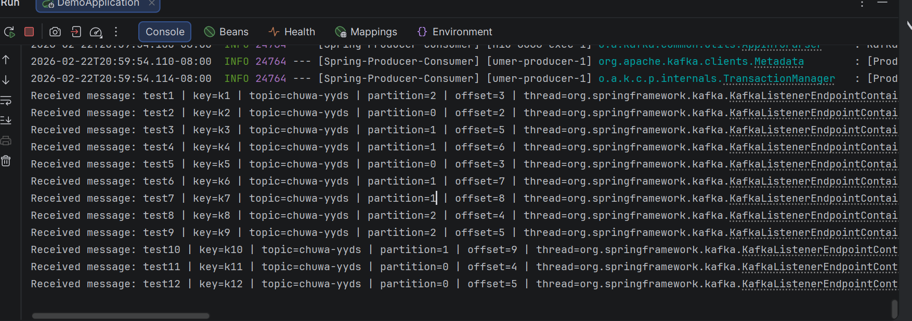
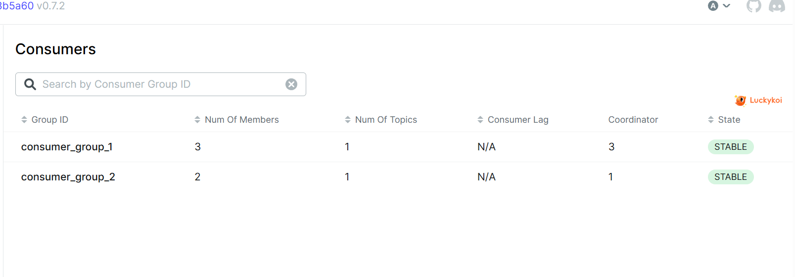
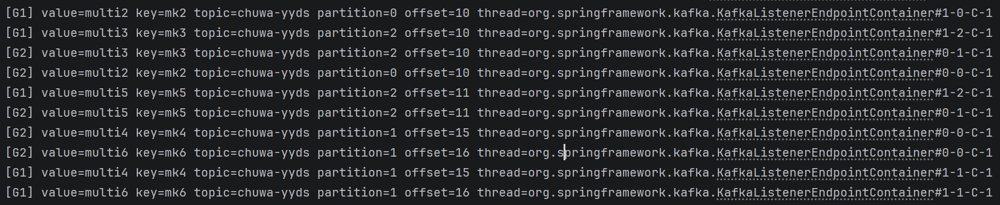
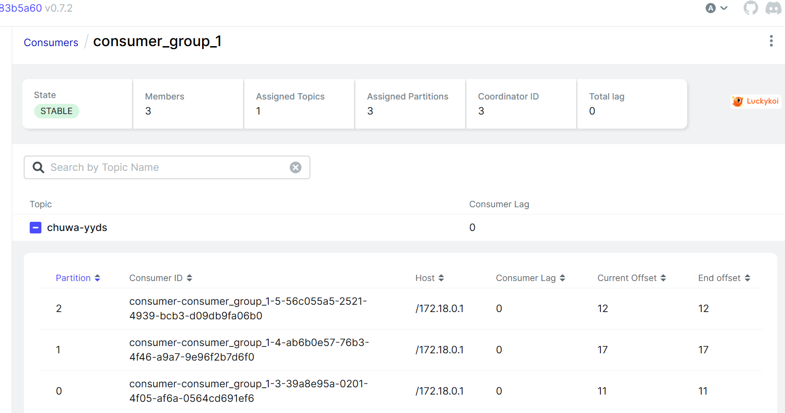
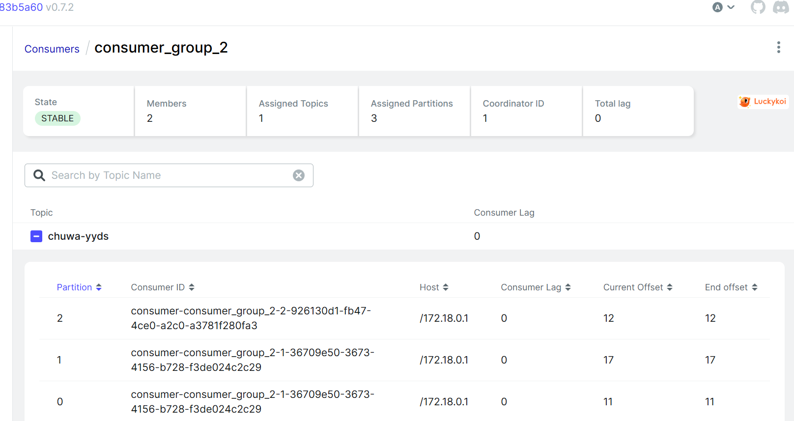
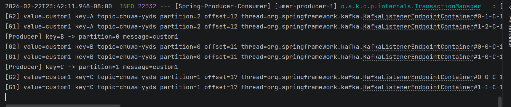

# Chuwa 0128 HW18 - Q10
Delin Liang  
Due: Feb 23, 2026  

---
## 10.1

---
## 10.2

### Observation
When I increased the number of consumers (listener concurrency) in the same consumer group from 3 to 6, only 3 consumers kept consuming messages. The logs still show only 3 active consumer threads and messages are consumed from partitions 0/1/2

### Explanation
Within a single consumer group, each partition can be assigned to at most one consumer at a time. Since topic chuwa-yyds has 3 partitions, at most 3 consumers can actively consume in parallel. When the number of consumers exceeds the number of partitions, the extra consumers stay idle (no partition assignment, no message consumption)

---
## 10.3

**Obervation**: Kafka maintains offsets per consumer group.
Each group independently tracks its own consumption progress on each partition.
Therefore, multiple consumer groups can consume the same topic without interfering with each other

---
## 10.4

We created two consumer groups: consumer_group_1 (3 consumers) and consumer_group_2 (2 consumers)

From the Kafka UI:
- Both groups are in STABLE state
- Each group is assigned 3 partitions of topic chuwa-yyds
- The Current Offset equals the End Offset
- Consumer lag is 0

This proves that both consumer groups are independently consuming messages and maintaining their own committed offsets

---
## 10.5

### 1) At-most-once
- commit before processing
- may lose messages

### 2) At-least-once 
- process first, commit after
- may duplicate

### 3) Exactly-once (EOS) 
- transactional consume-process-produce
- Exactly-once in Kafka is most realistic when your app does consume → process → produce (read from one topic and write to another topic) using Kafka transactions

---
## 10.6
