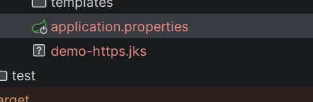
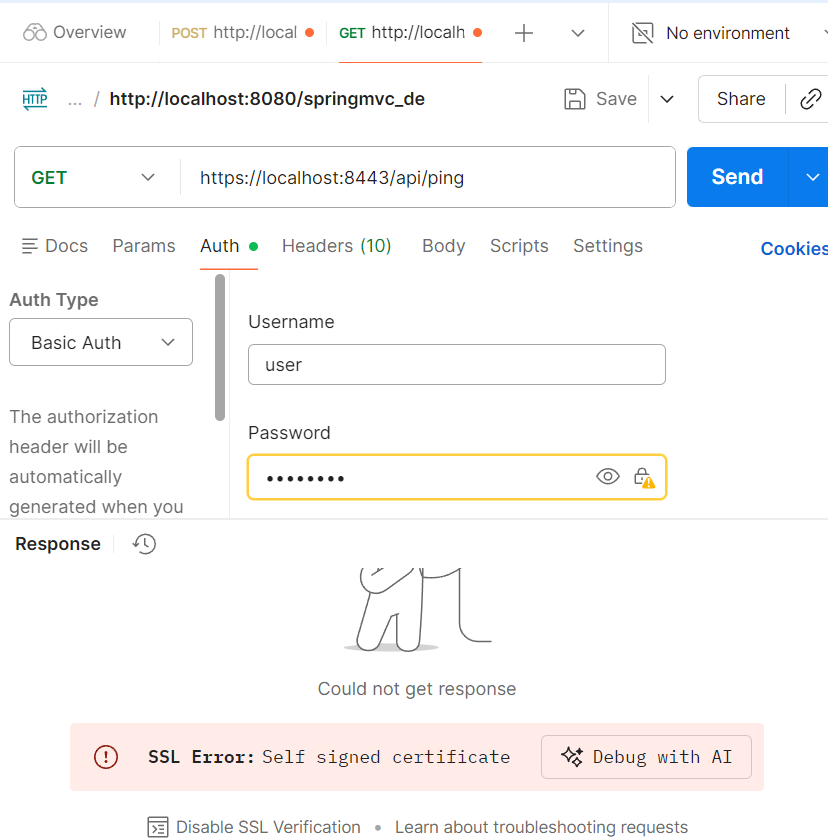
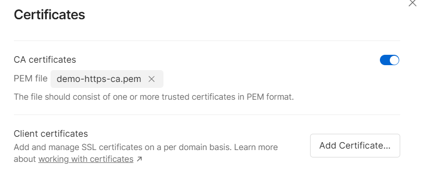
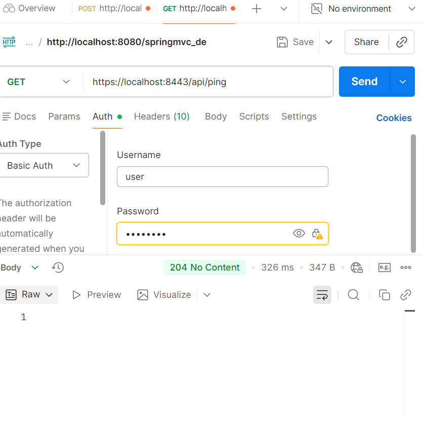
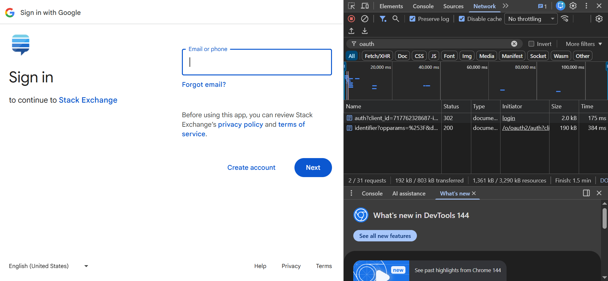
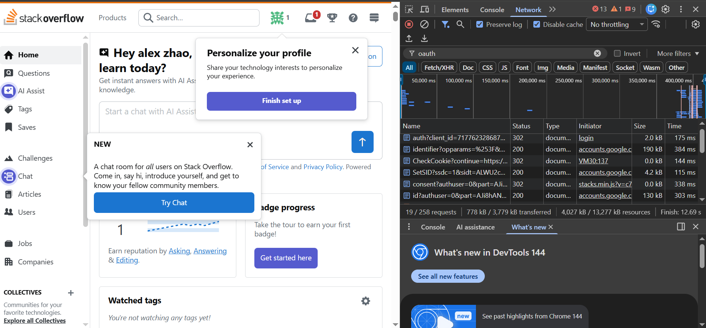
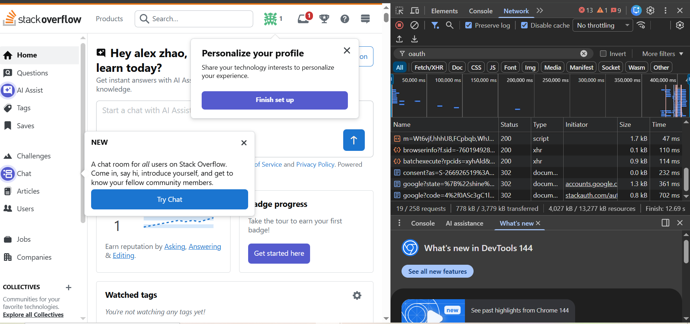
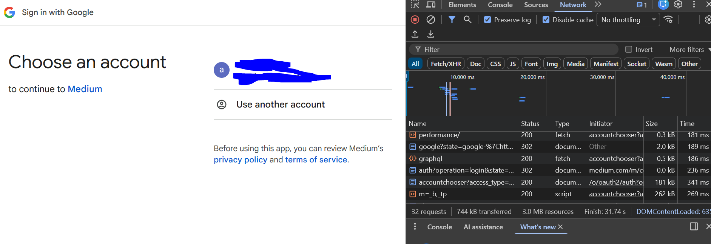
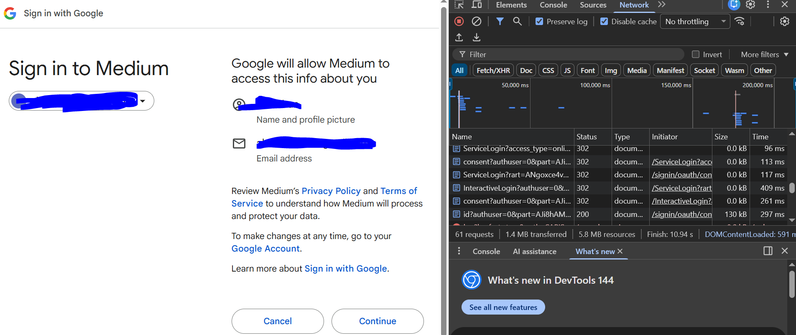
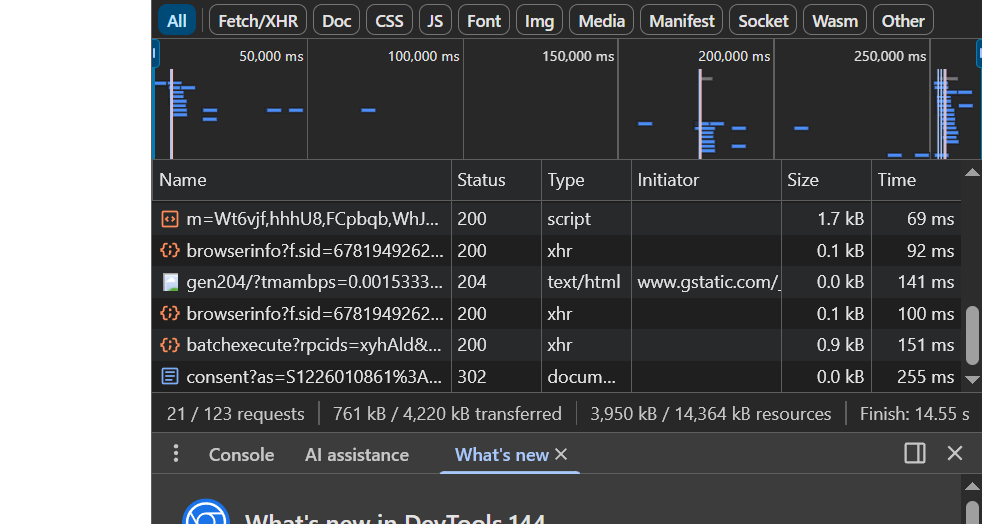

# Chuwa 0128 HW12 - Short Answer
Delin Liang <br>
Due: Feb 02, 2026 <br>

_Note: for Q1, please check the `annotaitons.md` file_

---
### Q2 - Explain TLS, PKI, certificate, public key, private key, and signature.

**TLS (Transport Layer Security)**<br>
TLS is a security protocol that encrypts data in transit and ensures secure communication between client and server, commonly used in HTTPS

**PKI (Public key infrastructure)**<br>
PKI is a trust framework that manages public/private keys and digital certificates to verify identities in secure communications
It is used to create, manage, distribute, use, store and revoke certificates and manage public-key encryption

**Certificate**<br>
A digital certificate binds a public key to an identity and is issued and signed by a trusted Certificate Authority (CA)

**Public Key**<br>
A public key is shared openly and is used to encrypt data or verify digital signatures

**Private Key**<br>
A private key is kept secret and is used to decrypt data or generate digital signatures

**Signature / Digital Signature**
A digital signature is created using a private key and verified with a public key to ensure data integrity and sender authenticity

---
### Q3 - Write a Spring security based application

#### 3.1 Generate `jks` file
Generated jks file using keytool


#### 3.2 Test if you can verify your HTTPs api without importing the self-signed certificate to your local certificate chain, if not, explain why
No<br>

As shown in the screen shot above, Postman shows an SSL Error. This is because the server is using a self-signed certificate which is not trusted by the client’s trust store, TLS certificate validation fails

#### 3.3 Explain what did you do to make https call work
To make the HTTPS call work without disabling TLS/SSL verification, I exported the server’s self-signed certificate from the JKS keystore into a PEM file using keytool, and then imported this PEM file into Postman under CA Certificates, which added the self-signed certificate to Postman’s trusted CA store<br>

After the certificate was trusted by the client, the TLS handshake succeeded and the HTTPS API could be accessed securely while keeping SSL certificate verification enabled


---
### Q4 - list all http status codes that related to authentication and authorization failures

`401 Unauthorized`<br>
Authentication is missing, expired, or invalid

`403 Forbidden`<br>
The user is authenticated but does not have sufficient permissions

`407 Proxy Authentication Required` <br>
Authentication is needed to be done by a proxy

`400 Bad Request`<br>
Malformed or invalid authentication data (perceived to be a client error)

`419 Authentication Timeout`<br
Authentication session has expired and re-login is required

`302 Found (Redirect)`<br>
Unauthenticated users are redirected to a login page instead of receiving an error

---
### Q5 - Compare authentication and authorization? Name and explain important components in Spring security that undertake authentication and authorization

#### **Authentication** - "who are you?"
Authentication is the process of verifying **who the user is**, usually by validating credentials such as username and password
- **Authentication-related Spring Security Components**
    - `UserDetailsService`: Loads user information data
    - `AuthenticationProvider`: Performs the authentication logic by validating credentials against user data
    - `AuthenticationManager`: Coordinates authentication by delegating authentication requests to one or more `AuthenticationProvider`s
    - `AuthenticationFilter`: Intercepts login requests, extracts credentials or tokens, and triggers the authentication process

#### **Authorization** - "can this user do this?"
Authorization is the process of determining **what the authenticated user is allowed to do**, such as accessing specific APIs or resources
- **Authorization-related Spring Security Components**
    - `SecurityContext`: Stores the authenticated user’s information (principal, credentials, and authorities)
        - `SecurityContextHolder`: A static holder that stores and provides access to the current `SecurityContext`, usually using thread-local storage
    - `AccessDecisionManager`: Decides whether an authenticated user has permission to access a specific resource
    - `GrantedAuthority`: Represents a permission or role assigned to a user
    - `@PreAuthorize` / `@PostAuthorize`: Performs method-level authorization checks based on roles or permissions

---
### Q6 - Explain HTTP Session?
An HTTP session is a **server-side** mechanism used to store user-specific data across multiple HTTP requests<br>
The server identifies the session using a `session ID` that is sent to the client and returned with each subsequent request

---
### Q7 - Explain Cookie? 
A cookie is a small piece of data stored on the client side (browser) that is sent by the server and automatically included in the subsequent HTTP requests to maintain user state

---
### Q8 - Compare Session and Cookie?
|                  | Session                                | Cookie                                 |
| ---------------- | -------------------------------------- | -------------------------------------- |
| Storage location | Server-side                            | Client-side (browser)                  |
| Data stored      | User state and sensitive data          | Small pieces of user-related data      |
| Identifier       | Session ID (e.g., JSESSIONID)          | Cookie name-value pairs                |
| Security         | More secure (data stays on server)     | Less secure (stored on client)         |
| Size limit       | No strict limit (depends on server)    | Limited size (usually ~4KB)            |
| Lifetime         | Expires when session ends or times out (server controlled) | Can persist until expiration time  (client controlled)    |
| Performance      | Uses server memory                     | Minimal server resource usage          |

---
### Q9 - Find at least TWO websites who can be logged in using your Google Account, explain in detail on how Google SSO works with screenshots like below, find SSO-related Rest calls in Chrome developer tool:

#### Website 01: `https://stackoverflow.com/`
**Step 1 - Redirect to Google Authorization Endpoint**<br>
After clicking on "Login with Google", StackOverflow redirects the browser to Google’s OAuth authorization endpoint (`accounts.google.com`) with parameters such as `client_id` to initiate Google SSO 
 - **SSO-related Rest call**: See the first line with status code `302`
    - Rquest url: `accounts.google.com/o/oauth2/auth?client_id=...`
    - This request is sent when clicking “Log in with Google” and initiates the Google SSO process, the `client_id` identifies StackOverflow as the OAuth client


**Step 2 - User Authentication and Consent at Google** <br>
The user then authenticates with Google and grants permission for StackOverflow to use the Google account for login
- **SSO-related Rest call**: 
    - See the two lines that starts with `identifier?opparams=...` and `consent?authuser=...`
    - These requests handle user login and permission approval and is entierly ocuured and handled in Google's site


**Step 3 - Redirect Back to StackOverflow with Authorization Code**
After successful authentication, Google redirects the browser back to StackOverflow with an authorization code, which is exchanged for tokens on the backend and results in a successful login 
- **SSO-related Rest call**: 
    - See the line sent by `stackauth.com`
    - Through these calss, Google redirects the browser back with an authorization code (`stackoverflow.com/users/oauth/google?code=...`), and StackOverflow exchanges the code for tokens on the backend


#### Website 02: `https://medium.com/`
This site follows the similar steps as stackoverflow, so I am only listing the SSO related calls in each screen shots

SCREENSHOT01

In this step, the SSO related calls are:
- `https://accounts.google.com/v3/signin/accountchooser?access_type=online&client_id=...`
- `https://accounts.google.com/o/oauth2/auth?operation=login&state=google...`

Browser is redirected Google Authorization Endpoint

<br>
SCREENSHOT02


In this step, the SSO related calls are:
- `https://accounts.google.com/ServiceLogin?rart=...`
- `https://accounts.google.com/signin/oauth/consent?authuser=...`

Here, Google handles user authentication

<br>
SCREENSHOT03


In this step, the SSO related calls are:
- `https://accounts.google.com/signin/oauth/consent?as=...`

Browser is redirected back to Medium with authorization code

---
### Q10 - How do we use session and cookie to keep user information across the the application?
After a user login, the server 
- creates a **session** to store user information
- use a cookie to send the session ID to the client using **cookie**

The cookie is sent with each request, allowing the server to identify the user and maintain state across the application

---
### Q11 - What is the spring security filter?
The Spring Security Filter is **a chain of servlet filters** that intercepts every incoming HTTP requests to handle **authentication**, **authorization**, and **security checks** before the request reaches the controller

---
### Q12 - Explain bearer token and how JWT works.
#### Bearer Token
An access roken that allows anyone who possesses it to to access protected resources, usually sent in the `Authorization: Bearer <token>` HTTP header

#### How JWT(JSON Web Token) works
A JWT (JSON Web Token) is a type of bearer token that contains signed claims (header, payload, signature) and used for stateless authentication<br>
- After a user successfully logs in, the server generates a JWT containing user information (claims), signs it, and returns it to the client
- The client stores the token and sends it with every subsequent request
- The server verifies the token’s signature and expiration to authenticate the user and authorize access, without storing session data on the server


---
### Q13 - Explain how do we store sensitive user information such as password and credit card number in DB? 
- **Passwords**: Stored in salted, slow on-way hash (e.g. `bcrypt`,`Argon2`). During login, hash the entered password the same way and compare hashes
- **Credit Card Number**: Store only last 4 digits for display and encrypt the full number with strong encryption (e.g., `AES`) and proper key management/rotation (KMS/HSM)

_IMPORTANT: We should NEVER save sensitive user info in plaintext_

---
### Q14 - Compare `UserDetailService`, `AuthenticationProvider`, `AuthenticationManager`, `AuthenticationFilter`?

#### `UserDetailService`
Loads user data(e.g. username, password hash, roles/authorities) from a data source (e.g. database) when given a username/email

#### `AuthenticationProvider`
Performs the authentication checks(validates credentials or token) using data from `UserDetailService` and a `PasswordEncoder`, then returns an authenticated `Authentication` object

#### `AuthenticationManager`
The coordinator/entry point for authentication: recieve an authentication request and deligates it to one or more `AuthenticationProvider`

#### `AuthenticationFilter`
Intercepts incoming HTTP requests, extracts credentials (e.g., username/password) or a token (e.g., JWT from `Authorization` header), and calls the `AuthenticationManager` or directly sets `SecurityContext` for JWT-style flows before the request reaches controllers

---
### Q15 - What is the disadvantage of Session? how to overcome the disadvantage?

#### Disadvantages of Session
- Sessions are server-side states, which increase memory usage
- Sessions do not scale well with distributed systems without extra setup
- Seesion is typically tied to a single server, causing issues with load balancing
- Session expiration or server restart may cause the suers to be logged out


#### How to overcome
- Use stateless authentication such as JWT instead of server-side sessions
- Use session sharing with a centralized store (e.g., Redis) in multi-server environments
- Apply sticky sessions at the load balancer
- Set proper session timeout and cleanup policies

---
### Q16 - how to get value from `application.properties` in Spring security?
We can use `@Value` or `@ConfigurationProperties` to retrive values from `application.properties` in Spring security

#### Using `@Value`
It retrives values by injecting the property value directly into a Spring-managed bean <br>
This is commonly used in Spring Security components (e.g., JWT provider)<br>
Example:
```java
@Value("${app.jwt-secret}")
private String jwtSecret;
```

#### Using `@ConfigurationProperties`
It retrive values by binding multiple related properties into a configuration class, which is useful for managing security-related settings together<br>
Example:
```java
@ConfigurationProperties(prefix = "app")
public class JwtProperties {
    private String jwtSecret;
}
```

---
### Q17 - What is the role of `configure(HttpSecurity http)` and `configure(AuthenticationManagerBuilder auth)`?

#### `configure(HttpSecurity http)`
Defines authorization rules for HTTP requests. It controls what is protected and how reuqests are secured

#### `configure(AuthenticationManagerBuilder auth)`
Configures how authentications is performed, or to say how users are authenticated

---
### Q19 - Explain best practices to securely store secrets in applications
- Never hard code secrets in source codes
- Use secrets managers (e.g., cloud KMS/Secrets Manager/Vault) and fetch them at runtime
- Use environment variables or protected config injection
- Encrypt secrets at rest and in transit (TLS for secret retrieval and service calls)
- Restrict access and audit
- Avoid exposure to client
- Use short-lived credentials when possible
- Rotate regularly and immediately rotate on suspected exposure


